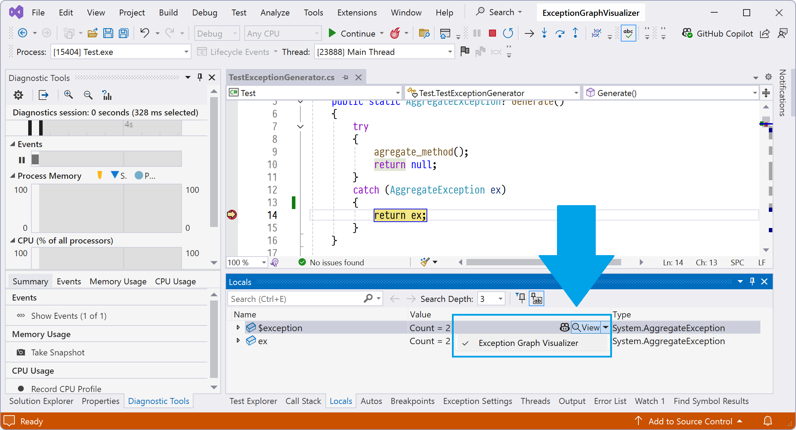
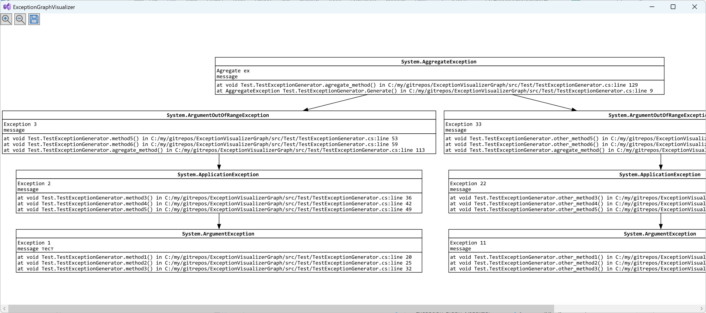

# ExceptionGraphVisualizer Visual Studio 2022 plugin
The plugin for Visual Studio 2022 that shows exceptions as a graph with all its inner exceptions and stack traces.

# How to use
The visualizer can be used during debugging 
 
After clicking on the `Exception Graph Visualizer` button, the graph is shown is a separate window

# Extra features
* The exception stack trace is demystified using [Ben.Demystifier](https://github.com/benaadams/Ben.Demystifier) 
* Shortcuts:
  * `Ctrl + S` - Save SVG
  * `Ctrl + ScrollUp` - Zoom in
  * `Ctrl + ScrollDown` - Zoom out

# System requirements
* Windows x64
* Visual Studio 2022 17.0 or higher

# How to install
Download and install the `msi` file from the latest [release](https://github.com/PolarGoose/VisualStudio_ExceptionGraphVisualizer_plugin/releases)

## Why not VSIX installer
Unfortunately, VSIX doesn't support the deployment of debugger visualizer plugins. [More details](https://stackoverflow.com/a/79288488/7585517)
